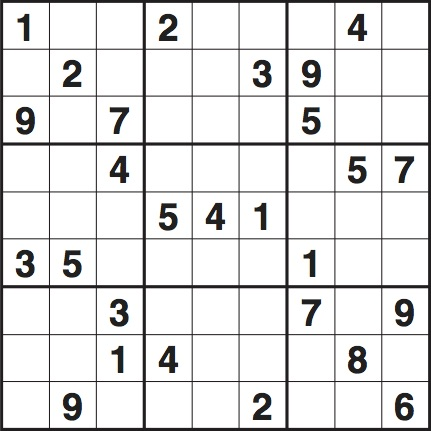
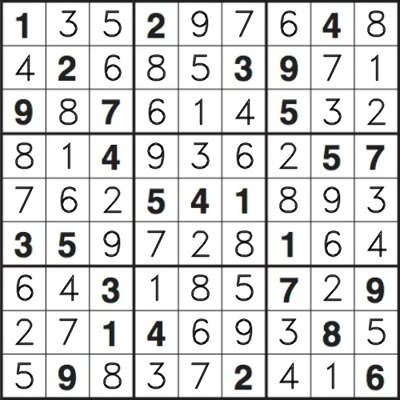

# Solve SUDOKU from Image
A project to solve a Sudoku from a given image. 

### Input
Image file with unsolved Sudoku

<p align="center">
  
</p>

### Output
The same image file with filled in solution

<p align="center">
  
</p>

### Contents

#### sudoku_solver.py 
Provides functions to solve a sudoku puzzle.

Sudokus are formatted as a string where the rows are concatenated and empty spaces are represented as "0" or as ".".

"100200040020003900907000500004000057000541000350000100003000709001400080090002006"

#### solve_sudoku_from_image.py

Takes an image of a unresolved Sudoku puzzle as input, detects the existing digits, solves the Sudoku and returns the given image with the solution filled in. The output file is stored to the same directory as the input and has "\_solved" concatenated to the image name.

```
python3 solve_sudoku_from_image.py --image <path>
```
OpenCV2 is used for the image processing.

Tesseract is used to detect the digits in the given image.
